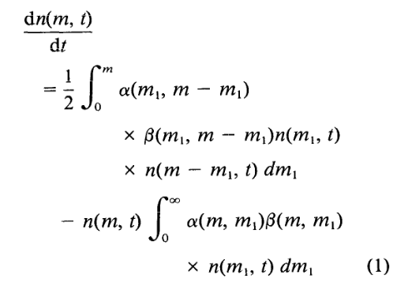
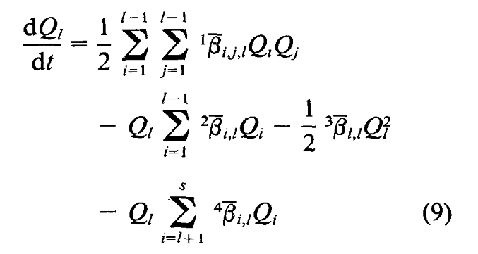
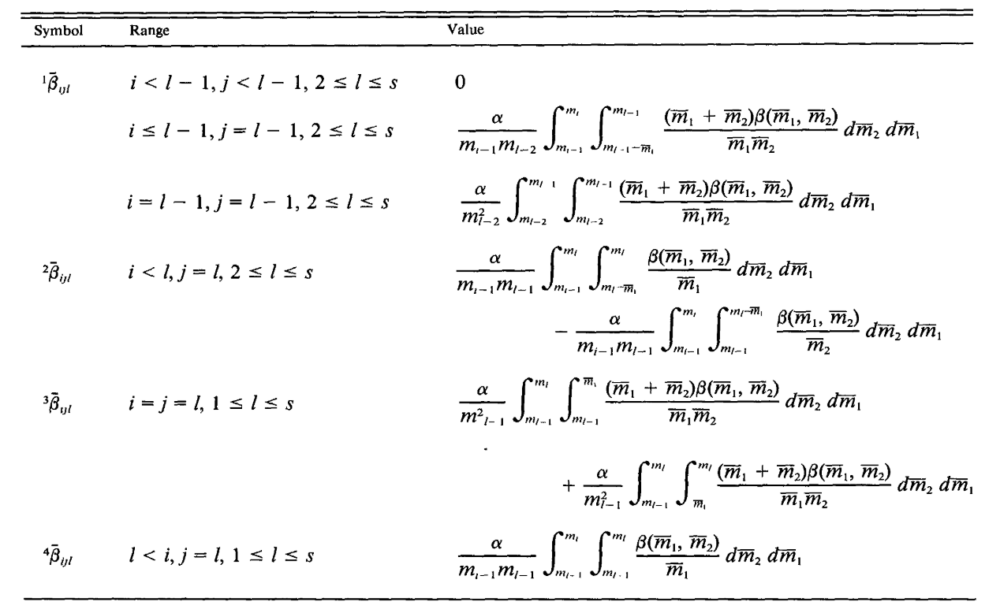

# particle aggregation model

## Overview

This model calculates particle aggregation based on discrete aggregate size classes within a volume (0D box). 
It is based on paper of [Jackson and Lochmann (1992)](https://doi.org/10.4319/lo.1992.37.1.0077) and [Adrian Burd (2013)](https://doi.org/10.1002/jgrc.20255).
This python implementation is based on Matlab code by Adrian Burd (found in `coag_model_adrian_matlab`) which was adapted from the code of George Jackson.

For a more detailed description and context read the [Jackson and Lochmann (1992) paper](https://doi.org/10.4319/lo.1992.37.1.0077), but the general idea goes as follows.
We would like to make predictions about the time evolution of a aggregate size distribution $\frac{dn(m,t)}{dt}$, where $n(m,t)$ is the number of particles of mass $m$ at time $t$

$alpha$ represents the sicking probability, $beta$ is referred to as the coagulation kernel - a measure of the probability of collisions between aggregates.

Integrating this directly proves difficult. To gain some traction we therefore discretize the aggreates into a discrete size spectrum.
To make the calculations easier a size bin is defined to range from their lower mass boundary to twice their lower mass boundary, $m_{lower}$ to $2m_{lower} = m_{upper}$.
Using this discretization equation 1 can be rewritten as:

$dQ_i/dt$ represents the change in mass of size bin $i$ 
$^{i} \beta$ are referred to sectional coagulation kernels. Each represents a different class of aggregate interactions (e.g. collisions between aggregates in the same size bin, collisions between aggregates in adjacent size bins, etc.) and is defined as:

Based on the index ranges within the table, the interactions can be visualized as interactions between bins as follows:

## How to install

## How to run

